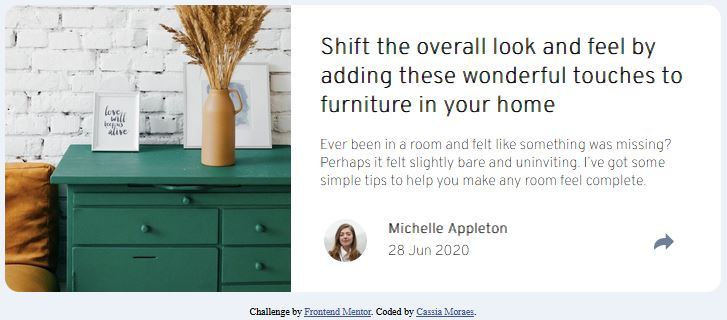
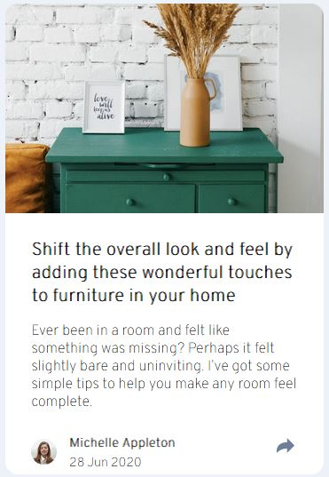

# Frontend Mentor - Article preview component solution

This is a solution to the [Article preview component challenge on Frontend Mentor](https://www.frontendmentor.io/challenges/article-preview-component-dYBN_pYFT). Frontend Mentor challenges help you improve your coding skills by building realistic projects. 

## Table of contents

- [Overview](#overview)
  - [The challenge](#the-challenge)
  - [Screenshot](#screenshot)
  - [Links](#links)
- [My process](#my-process)
  - [Built with](#built-with)
  - [What I learned](#what-i-learned)
  - [Useful resources](#useful-resources)
- [Author](#author)
- [Acknowledgments](#acknowledgments)

## Overview

### The challenge

Users should be able to:

- View the optimal layout for the component depending on their device's screen size
- See the social media share links when they click the share icon

### Screenshot

Desktop version


Mobile version


### Links

- Solution URL: [Add solution URL here](https://your-solution-url.com)
- Live Site URL: [Add live site URL here](https://your-live-site-url.com)

## My process

### Built with

- Semantic HTML5 markup
- CSS custom properties
- Flexbox
- CSS Grid
- Mobile-first workflow
- [React](https://reactjs.org/) - JS library
- [Next.js](https://nextjs.org/) - React framework
- [Styled Components](https://styled-components.com/) - For styles

### What I learned

In this session, I learned how to use javascript to hide and show divs with click in the button. It also helped me to work better with the outline of elements in html.

To see how you can add code snippets, see below:

```html
<div><button></button></div>
```
```css
.conteudo #shareicon{
    position: absolute;
    margin-top:15rem;
    margin-left: 20rem;
    width: 1.4rem;
    border-radius: 0;
    cursor: pointer;

}
@media all and (max-width: 900px) {
  .conteudo #shareicon{
        margin-top: 33.2rem;
        position: absolute;
        margin-left: 21rem;
        max-width: 1.5rem;
        border-radius: 0;
        cursor: pointer;
    
    }
}
```
```js
const share = document.querySelector('#shareicon')

share.addEventListener("click", (elemento) =>{
    mostraDiv()     
})

function mostraDiv() {
    div.style.display ="block";
}
```

### Useful resources

- [Example resource 1](https://www.guj.com.br/t/fechar-modal-ao-clicar-fora-dele-js/423736/2)
- [Example resource 2](https://www.w3schools.com/jsref/event_onmouseenter.asp) 
- [Example resource 3](https://www.w3schools.com/jsref/obj_mouseevent.asp) 

## Author

- LinkedIn - [Cassia Moraes](https://www.linkedin.com/in/cassia-moraes-797797139)
- Frontend Mentor - [@cassiality](https://www.frontendmentor.io/profile/cassiality)
